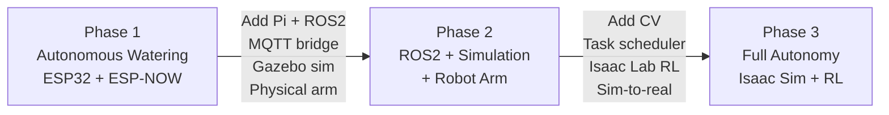

# System Architecture Overview

## Detailed diagrams

- [Phase 1 — Autonomous Watering](phase1.md)
- [Phase 2 — ROS2, Simulation & Robot Arm](phase2.md)
- [Phase 3 — Full Autonomy](phase3.md)

## Technology stack by phase

| Layer | Phase 1 | Phase 2 | Phase 3 |
|---|---|---|---|
| Sensors | ESP32 + ESP-NOW | ESP32 + MQTT | micro-ROS |
| Compute | ESP32 Brain | Raspberry Pi 4/5 | Raspberry Pi 4/5 |
| Middleware | — | ROS2 + DDS | ROS2 + DDS |
| Motion planning | — | MoveIt2 + Gazebo | MoveIt2 + Gazebo |
| ML / Training | — | — | Isaac Sim + Isaac Lab |
| Manipulation | — | Robot arm (teleoperated) | Robot arm (autonomous) |
