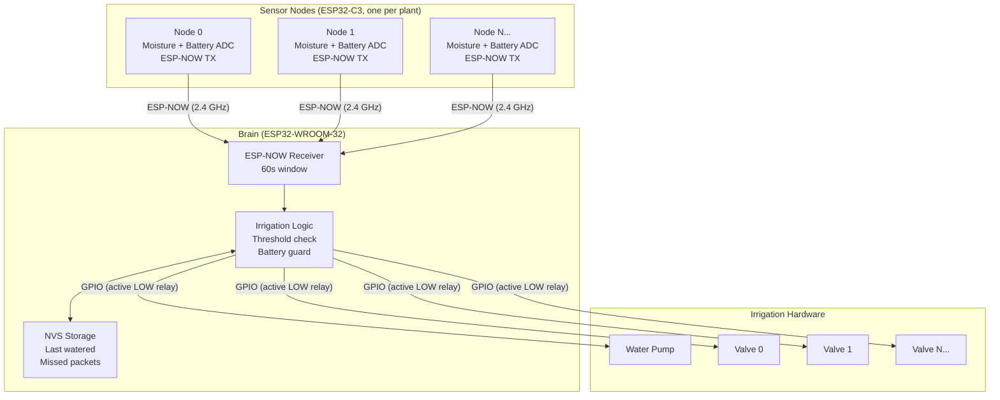

# Phase 1 — Autonomous Watering

## Cycle

1. Every 30 minutes, each sensor node wakes from deep sleep
2. Reads soil moisture (ADC) and battery voltage
3. Transmits `SensorPacket` to Brain via ESP-NOW; goes back to sleep
4. Brain wakes on the same 30-minute cycle; opens a 60s receive window
5. After window closes, checks each plant's moisture against threshold
6. Opens valve + runs pump for configured duration if moisture is low
7. Brain goes back to deep sleep

## Key constraints

- No WiFi router required — ESP-NOW is peer-to-peer
- Brain skips irrigation entirely when battery < 4.4 V
- Up to 10 plants supported (Node IDs 0–9)
