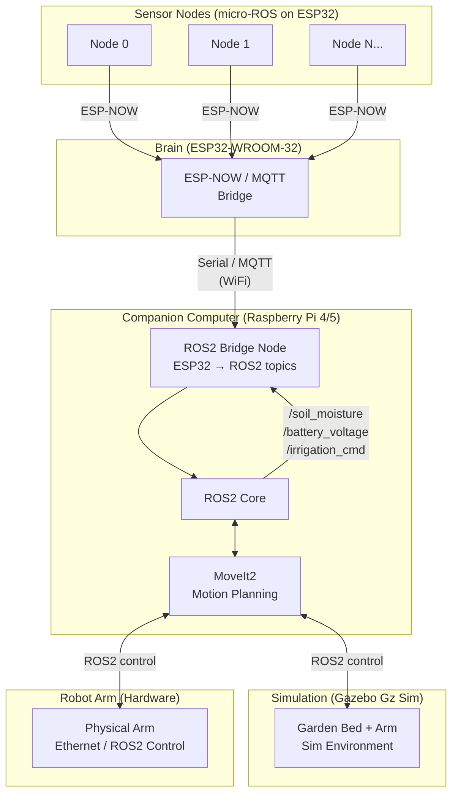

# Phase 2 — ROS2, Simulation & Robot Arm

## ROS2 Topics

| Topic | Direction | Description |
|---|---|---|
| `/soil_moisture` | Brain → ROS2 | Per-plant moisture % |
| `/battery_voltage` | Brain → ROS2 | Per-node battery voltage |
| `/irrigation_cmd` | ROS2 → Brain | Override irrigation commands |
| `/arm/joint_states` | Arm → ROS2 | Current joint positions |
| `/arm/goal` | ROS2 → Arm | MoveIt2 motion goal |

## Transport layers

- **ESP-NOW** — sensor nodes to Brain (2.4 GHz, no router)
- **MQTT over WiFi** — Brain to Pi bridge
- **ROS2 / DDS over WiFi** — Pi to operator laptop
- **Ethernet** — Pi to robot arm controller (real-time control)

## Workflow

1. Simulate arm + garden bed in Gazebo first; validate all motion plans with MoveIt2
2. Wire up Brain → MQTT → ROS2 bridge for live sensor data on ROS2 topics
3. Deploy physical arm; replay validated motion plans on hardware
4. Migrate sensor nodes from ESP-NOW to micro-ROS for native ROS2 pub/sub
