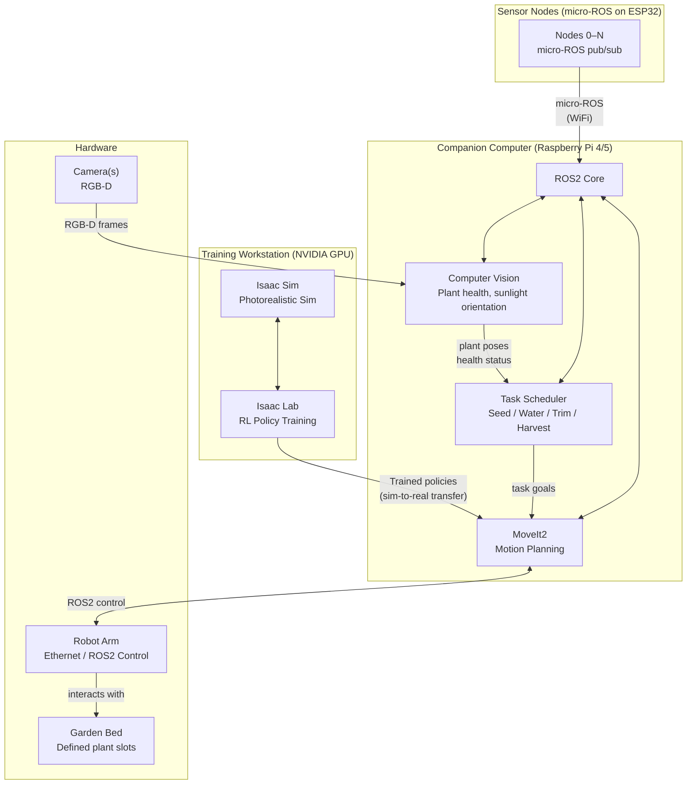

# Phase 3 — Full Autonomy

## Capabilities

- **Computer vision** — RGB-D camera identifies plant health, growth stage, and optimal sunlight orientation
- **Task scheduling** — autonomous seeding, watering, trimming, harvesting based on plant state
- **RL-trained manipulation** — Isaac Lab trains dexterous policies (grasping stems, trimming, harvesting) using PhysX 5 soft-body/deformable physics; policies transfer to hardware via sim-to-real
- **Sunlight orientation** — arm repositions plants throughout the day to maximize light exposure

## Simulation split

| Tool | Purpose |
|---|---|
| **Gazebo** | ROS2 control integration testing, motion plan validation |
| **Isaac Sim** | Photorealistic synthetic data for vision model training |
| **Isaac Lab** | RL policy development for dexterous manipulation |

## Hardware requirements

- NVIDIA GPU (RTX series) required for Isaac Sim on the training workstation
- Pi handles real-time ROS2 control; GPU workstation handles offline training only
